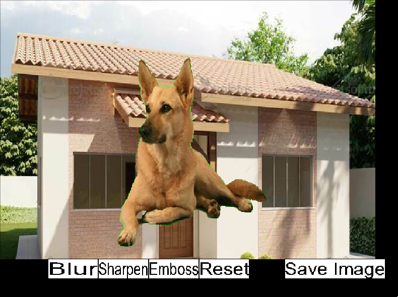

# SDL2 Image Filters

A desktop application for applying convolution filters to images, written in C++ with [SDL2](https://www.libsdl.org/). Developed as a college project for a Game Development course.

The program loads an image, optionally composites it over a background using chroma key (green screen removal), and lets you apply filters interactively through an on-screen UI. The result can be saved back to disk as a PNG.



## Features

- **Blur** — smooths the image using a convolution kernel
- **Sharpen** — enhances edges and fine detail
- **Emboss** — gives the image a relief/engraved look
- **Chroma key** — replaces green pixels (with a configurable tolerance) with the pixels of a background image, like a green screen effect
- **Reset** — restores the original image, discarding all applied filters
- **Save** — exports the current result to `output.png`

Filters are implemented from scratch with direct per-pixel access to SDL surfaces — no image-processing libraries are used.

## How it works

1. On startup, the program asks in the terminal for the path to an image file.
2. It then asks whether you want a background (`y`/`n`). If yes, you provide a second image path and the green areas of the first image are replaced with the background via chroma key.
3. A window opens showing the image with buttons at the bottom: **Blur**, **Sharpen**, **Emboss**, **Reset** and **Save Image**.
4. Filters can be applied multiple times and stacked; **Reset** returns to the original image.

Sample images are included in the repository (`dog.png`, `casa.png`, `meme.png`, `bkg.png`) for testing.

## Dependencies

- A C++17 compiler
- SDL2
- SDL2_image
- SDL2_ttf
- `pkg-config` and GNU Make

On Nix/NixOS, a `shell.nix` is provided with everything needed:

```bash
nix-shell
```

## Building and running

```bash
make
./sdl2-image-filters
```

To remove build artifacts:

```bash
make clean
```

## Project structure

| File | Description |
| --- | --- |
| `main.cpp` | Entry point: SDL setup, chroma key compositing, UI layout and event loop |
| `Image.cpp` / `Image.h` | Image loading, rendering, pixel access and the filter implementations |
| `Button.cpp` / `Button.h` | Simple clickable button rendered with SDL_ttf |
| `Input.cpp` / `Input.h` | Terminal prompts for the image and background paths |
